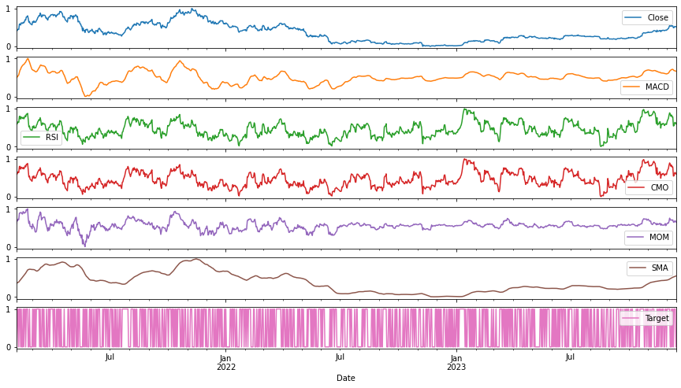

# Machine Learning in Finance



This repository contains a collection of projects applying machine learning techniques to various financial problems. The projects cover different areas including time series forecasting, price prediction using deep learning, outlier detection for fraud prevention, and portfolio optimization. The repository is structured into multiple sub-projects, each focusing on specific methods and financial applications.

---

## Table of Contents

- [Project Overview](#project-overview)
- [Autoregressive Models](#autoregressive-models)
- [CNN, LSTM, Transformer, and Price Prediction](#cnn-lstm-transformer-and-price-prediction)
- [Isolation Forest for Outlier Detection](#isolation-forest-for-outlier-detection)
- [Portfolio Optimization](#portfolio-optimization)
- [Price Predictions](#price-predictions)
- [How to Use](#how-to-use)
- [Contributing](#contributing)

---

## Project Overview

The repository is organized into various projects that apply machine learning techniques to solve problems in the financial domain. These include predicting asset prices, detecting fraudulent activities, and optimizing financial portfolios. Each folder contains code, models, and Jupyter notebooks to demonstrate different approaches to these problems.

---
## Portfolio Optimization

This section focuses on optimizing financial portfolios using different strategies like mean-variance and risk parity.

- `mean_var_port.py`: Implements mean-variance portfolio optimization.
- `mean_var_port_leverage.py`: Adds leverage to the mean-variance optimization model.
- `risk_parity_port.py`: Implements risk-parity-based portfolio optimization.
- `readme.md`: Provides a detailed explanation of portfolio optimization techniques.

---

## Autoregressive Models

This folder contains projects that use autoregressive methods like ARIMA (AutoRegressive Integrated Moving Average) for time series analysis and prediction.

- `arima_model.py`: Implements a basic ARIMA model for time series forecasting.
- `lasso_ridge_regularization.py`: Uses Lasso and Ridge regularization methods to enhance model stability.
- `mean_var_port_rebalance.py`: Rebalances a portfolio using a mean-variance approach.
- `multivariate_arima.py`: Demonstrates multivariate ARIMA.

---

## Stock Price Predictions

This folder focuses on price prediction using machine learning techniques like Multi-Layer Perceptrons (MLP) for predicting financial asset prices.

- `price_pred_with_ml_mlp.ipynb`: Predicts asset prices using classical ML methods and MLP (multi-layer perceptrons) for financial data.

---

## CNN, LSTM, Transformer, and Price Prediction

This folder focuses on price prediction using various deep learning models such as Convolutional Neural Networks (CNN), Long Short-Term Memory (LSTM), and Transformers.

- `BTC Price Prediction LSTM.ipynb`: LSTM-based model for predicting Bitcoin prices.
- `Bitcoin Price Prediction LSTM.ipynb`: Another approach to Bitcoin price forecasting using deep learning.
- `Deep Learning for Time Series.ipynb`: Demonstrates various deep learning models for time series forecasting.
- `Sequence Models.ipynb`: Sequence-to-sequence modeling applied to financial datasets.
- `Stock Price Prediction via LSTM.ipynb`: Predicts stock prices using LSTM.
- `advance-prices-pred.ipynb`: Other techniques for price prediction with deep learning.

---

## Isolation Forest for Outlier Detection

The isolation forest algorithm is widely used for anomaly detection, including detecting fraudulent activities in financial transactions. This folder contains code and notebooks for building and evaluating outlier detection models.

- `1-creditcard-fraud.ipynb`: Detects fraud in credit card transactions.
- `2-synthetic-data-fraud-det.ipynb`: Applies outlier detection on synthetic data for fraud prevention.
- `3-outlier-detection.ipynb`: Basic outlier detection example.
- `4-CreditCardfraudDet.ipynb`: Another credit card fraud detection project.
- `5-finance-dataset.ipynb`: Detecting outliers in financial datasets.
- `6-outlier-detection.ipynb`: Extends outlier detection methods.
- `7-outlier-detection.ipynb`: More examples of outlier detection.


## How to Use

## Setup

```bash 

# 1. Clone the repo
git clone ....

# 2. install requirements
pip install -r requirements.txt

# Ready the data
# provided on demand
export FINANCE_DATA_DIR=~/finance_data
```

## Contributing

Contributions are welcomed! 